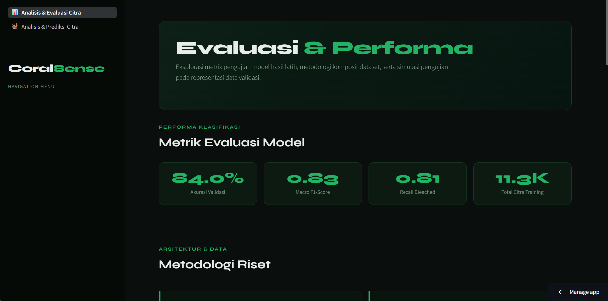

# 🪸 CoralSense: Klasifikasi Coral Bleaching dengan Grad-CAM

CoralSense merupakan aplikasi berbasis **Deep Learning** yang dikembangkan untuk membantu mengidentifikasi kondisi terumbu karang berdasarkan citra digital. Model mampu mengklasifikasikan citra menjadi dua kategori, yaitu **Bleached** dan **Healthy**, serta dilengkapi dengan visualisasi **Grad-CAM (Gradient-weighted Class Activation Mapping)** untuk menunjukkan area citra yang menjadi dasar pengambilan keputusan model.

> ⚠️ **Status Proyek:** Dalam tahap pengembangan (Work in Progress). Beberapa fitur masih akan terus disempurnakan.

---

# 📖 Daftar Isi

- [Tentang Proyek](#-tentang-proyek)
- [Fitur](#-fitur)
- [Teknologi yang Digunakan](#-teknologi-yang-digunakan)
- [Struktur Repository](#-struktur-repository)
- [Menjalankan Proyek Secara Lokal](#-menjalankan-proyek-secara-lokal)
- [Demo Aplikasi](#-demo-aplikasi)
- [Tampilan Aplikasi](#-tampilan-aplikasi)
- [Dataset](#-dataset)
- [Kontak](#-kontak)

---

# 📌 Tentang Proyek

Pemutihan karang (_Coral Bleaching_) merupakan salah satu ancaman terbesar bagi ekosistem laut. Proyek ini bertujuan membangun sistem klasifikasi citra menggunakan **Convolutional Neural Network (CNN)** yang dapat membantu mengidentifikasi kondisi karang secara otomatis.

Selain menghasilkan prediksi kelas, aplikasi juga memanfaatkan **Grad-CAM** sehingga pengguna dapat melihat bagian citra yang menjadi fokus model ketika melakukan klasifikasi.

---

# ✨ Fitur

- 🪸 Klasifikasi citra karang menjadi **Bleached** atau **Healthy**
- 🔥 Visualisasi **Grad-CAM**
- 📈 Menampilkan tingkat kepercayaan (confidence score)
- 🖼️ Upload gambar langsung melalui antarmuka web
- 💻 Dashboard interaktif menggunakan Streamlit

---

# 🛠️ Teknologi yang Digunakan

- Python
- TensorFlow / Keras
- Streamlit
- NumPy
- OpenCV
- Matplotlib
- Pillow
- ONNX Runtime

---

# 📂 Struktur Repository

```text
.
├── dashboard/
│   ├── app.py
│   ├── cnn_coral_bleaching_best.keras
│   ├── cnn_coral_bleaching_best.onnx
│   └── samples/
│
├── Klasifikasi_Coral_Bleaching_Dengan_GradCAM_v4_ColabVer.ipynb
├── requirements.txt
└── runtime.txt
```

---

# 🚀 Menjalankan Proyek Secara Lokal

### 1. Clone Repository

```bash
git clone https://github.com/FikriNash12/PI-Coral_Bleached_Classification_With_Grad-CAM-.git
```

Masuk ke folder project

```bash
cd PI-Coral_Bleached_Classification_With_Grad-CAM-
```

---

### 2. Install Dependencies

Disarankan menggunakan virtual environment.

```bash
pip install -r requirements.txt
```

---

### 3. Jalankan Aplikasi

Masuk ke folder dashboard

```bash
cd dashboard
```

Kemudian jalankan Streamlit

```bash
streamlit run app.py
```

Setelah berhasil dijalankan, aplikasi dapat diakses melalui browser pada alamat:

```text
http://localhost:8501
```

Untuk menghentikan aplikasi, tekan `CTRL + C` pada terminal.

---

# 🌐 Demo Aplikasi

Aplikasi dapat dicoba secara langsung melalui:

**🔗 https://coral-bleached-classification.streamlit.app/**

> Apabila aplikasi sedang tidak dapat diakses, kemungkinan layanan Streamlit sedang dalam kondisi _sleep_ atau sedang dilakukan pembaruan.

---

# 🖼️ Tampilan Aplikasi

> Tambahkan screenshot halaman utama aplikasi pada folder `images/`, kemudian ubah nama file sesuai contoh berikut.

```md
<p align="center">
  
</p>
```

---

# 📊 Cara Menggunakan

1. Buka aplikasi melalui browser.
2. Upload gambar terumbu karang.
3. Tunggu proses prediksi selesai.
4. Lihat hasil klasifikasi.
5. Amati visualisasi **Grad-CAM** untuk mengetahui area yang menjadi perhatian model.

---

# 📁 Dataset

Dataset yang digunakan berasal dari:

- NOAA PIFSC ESD Coral Bleaching Dataset
- CoralScapes Dataset

---

# 👨‍💻 Pengembang

**Nashril Fikri**

---

# 📧 Kontak

Apabila Anda menemukan bug, memiliki saran pengembangan, atau aplikasi demo sedang tidak dapat diakses, silakan menghubungi melalui email:

📩 **nashril1105fikri@gmail.com**
